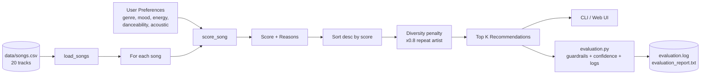

# System Architecture

**Components**
- **Retriever / Loader** — `load_songs` (csv → typed dicts).
- **Logic / Scorer** — `score_song` deterministic weighted sum with reasons.
- **Ranker** — `recommend_songs` sort + diversity penalty.
- **Evaluator** — `evaluation.py` runs profiles, computes confidence, checks guardrails, logs everything.
- **Human checkpoint** — CLI tables and the web demo make every score auditable by a human.
